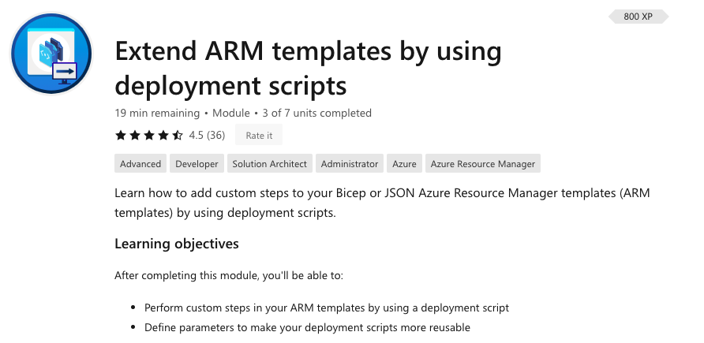
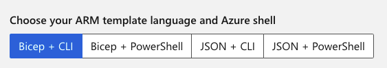

# What is this?

This folder contains the exercise files belonging to the *Learning Module* [Extend ARM templates by using deployment scripts](https://docs.microsoft.com/en-us/learn/modules/extend-resource-manager-template-deployment-scripts/) by Microsoft Learn.



<br>
<br>

The Module is part of the *Learning Path* [Deploy and manage resources in Azure by using Bicep](https://docs.microsoft.com/en-us/learn/paths/bicep-deploy/).

I'm using Bicep templates (instead of JSON ARM templates), and Azure CLI with Bash (instead of Azure PowerShell):



<br>
<br>

Here are the exercise files:

| Exercise | Description | Template |
| -------- | ----------- | -------- |
| [Exercise 1](https://docs.microsoft.com/en-us/learn/modules/extend-resource-manager-template-deployment-scripts/3-exercise-add-deployment-script?pivots=bicepcli) | Add a deployment script to an ARM template | [exercise1.main.bicep](exercise1.main.bicep) |
| [Exercise 2](https://docs.microsoft.com/en-us/learn/modules/extend-resource-manager-template-deployment-scripts/5-exercise-parameterize-deployment-script?pivots=bicepcli) | Add parameters to deployment scripts | [exercise2.main.bicep](exercise2.main.bicep) |


<br>
<br>
<br>

***

## Remarks

### Script Authorization

We need to create an RBAC role assignment: At resource group level the Managed Identity of the Deployment script (`principalId`) should be Contributor (`roleDefinitionId`).

```json
resource roleAssignment 'Microsoft.Authorization/roleAssignments@2020-04-01-preview' = {
  name: ...
  properties: {
    principalId: ...
    roleDefinitionId: ...
  }
```

Contributor is a built-in role. Each built-in role has a well known name, which is a GUID. For Contributor it's

```bash
b24988ac-6180-42a0-ab88-20f7382dd24c
```

You can find a list of all built-in roles in Azure [here](https://docs.microsoft.com/en-us/azure/role-based-access-control/built-in-roles). Or simply ask 

```bash 
az role definition list --name Contributor --query "[0].name" --output tsv
```
But `roleDefinitionId` is not the GUID by itself. Instead `roleDefinitionId` is the **resource id** of a role definition 

```bash
resourceId('Microsoft.Authorization/roleDefinitions', 'b24988ac-6180-42a0-ab88-20f7382dd24c')
```
This reads

```bash
/subscriptions/<subscriptionID>/resourceGroups/learndeploymentscript_exercise_1/providers/Microsoft.Authorization/roleDefinitions/b24988ac-6180-42a0-ab88-20f7382dd24c
```

