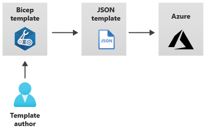

[Project Bicep on GitHub]: https://github.com/Azure/bicep
[Bicep documentation]: https://docs.microsoft.com/en-us/azure/azure-resource-manager/bicep
[ARM template documentation]: https://docs.microsoft.com/en-us/azure/azure-resource-manager/templates
[Terraform]: https://www.terraform.io
[MS Learn]: https://docs.microsoft.com/en-us/learn/modules/deploy-azure-resources-by-using-bicep-templates

## Scenarios

[Windows VM RDP](scenarios/WindowsVmBastion/) 

[Windows VM Bastion Host](scenarios/WindowsVmBastion) 

### What is Bicep?

* Bicep is a declarative language by Microsoft for describing and deploying Azure resources.

* Bicep is next generation Infrastructure as Code for Microsoft Azure.

* Bicep code is compiled into an ARM template. The main goal of Bicep is to write leaner, more readable code.

### How to learn Bicep?

* [Project Bicep on GitHub][Project Bicep on GitHub]

* [Bicep documentation][Bicep documentation]

* [ARM template documentation][ARM template documentation]

* [Build your first Bicep template - Module at Microsoft Learn][MS Learn]

